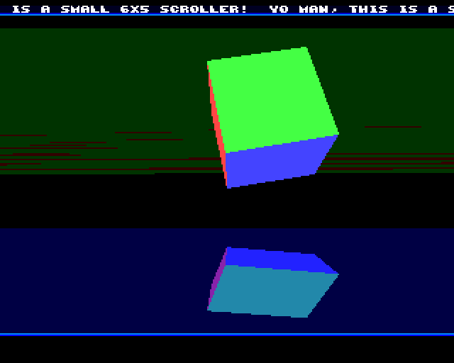
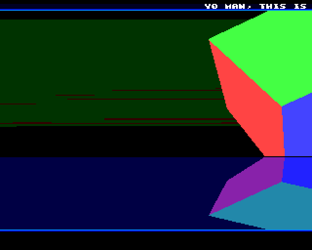

# Christopher goofing around with Amiga assembly

I learned to program using assembly on the Amiga in the early 90's and did some demoscene stuff for some years.

I recently looked through some of my old sources and got a bit inspired. So I installed the vasm cross-assembler, mounted the output dir on WinUAE emulating an A500 and started to goof around again with Amiga assembly.

This repo contains the results:

## Convex filled and clipped vectors
- a small 6x5 scroller
- blitter line draw
- clipping
- filling
- 3D transforms

 

## Resources

A list of things I found useful:
- [Amiga Hardware Reference Manual](http://amigadev.elowar.com/read/ADCD_2.1/Hardware_Manual_guide/node0000.html)
- [M68k instruction timings](https://wiki.neogeodev.org/index.php?title=68k_instructions_timings)
- [M68k Programmer's Reference Manual](https://www.nxp.com/files-static/archives/doc/ref_manual/M68000PRM.pdf)
- [Non-System Startup Code of StingRay](http://stingray.untergrund.net/MiniStartup.s)
- [How to write demos that work](http://amigacoding.com/images/b/b3/Howtocode5.txt)